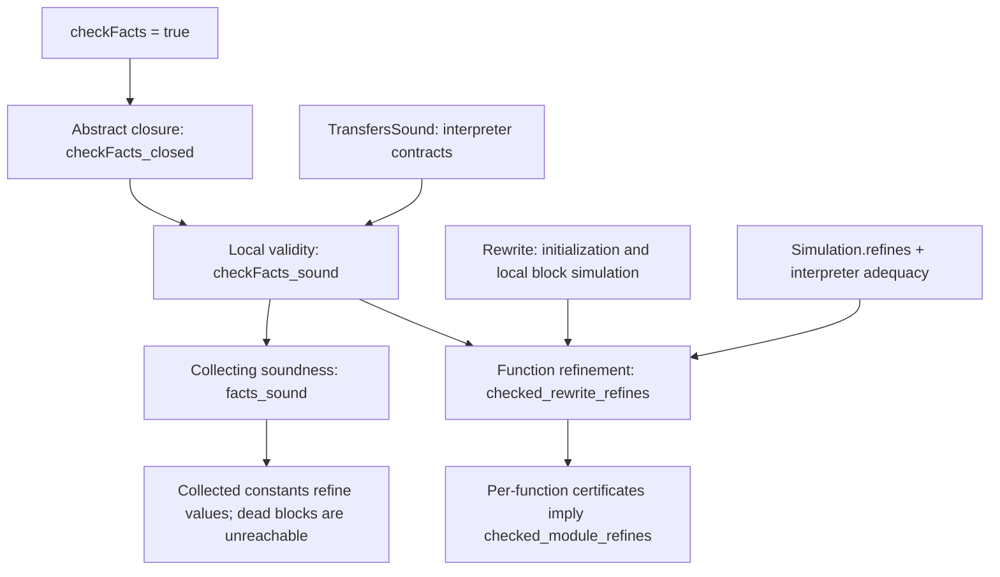

# SCCP proof interface

The entry point is [`SCCP.checked_rewrite_refines`](SCCPRefinement.lean).
Its essential statement is:

```lean
theorem checked_rewrite_refines
    (transfers : TransfersSound sourceCtx)
    (accepted : checkFacts sourceCtx candidate #[source.entry] = true)
    (rewrite : Rewrite candidate.toFacts source target) :
    sourceFunction.isRefinedBy targetFunction source.opInBounds target.opInBounds
```

`source` and `target` are `Collecting.FunctionBody` witnesses for the two
functions. They package the structural requirements of the interpreter: one
region, an entry block, and in-bounds pointers. `source.Initial` includes every
argument array and initial memory, with a fresh SSA environment. The conclusion
is Veir's existing function refinement, quantified over related source and
target arguments and the same initial memory.

The solver does not appear in the statement. It proposes a `Candidate`; the
checker establishes closure; transfer soundness connects the checked constraints
to the interpreter; the rewrite certificate supplies the local simulation.

`SCCP.checked_module_refines` lifts these per-function certificates to Veir's existing
`OperationPtr.isModuleRefinedBy` contract: every original top-level `func.func`
has a same-named refining target. This follows the current module contract; it
does not introduce semantics for calls or unsupported region operations.

```lean
theorem checked_module_refines
    (transfers : TransfersSound sourceCtx)
    (certificate : CheckedModuleCertificate source sourceCtx target targetCtx) :
    source.isModuleRefinedBy sourceCtx target targetCtx
```

The earlier `function_refines` and `module_refines` remain available for clients
that establish `Facts.Valid` directly.

## Roadmap for understanding and reviewing the work

Read the definitions and theorem statements first, then return to the proofs in
the order below. The reading order follows the argument, rather than the order
of declarations in each file. The central question is how one concrete execution
is covered by the combined SSA-value and CFG-executability facts, and how that
coverage justifies a rewrite of the entire function.

1. **Start with the conclusion and its three premises.** In
   [SCCPRefinement.lean](SCCPRefinement.lean), read `checked_rewrite_refines`,
   `Rewrite`, and `checked_module_refines`. Then inspect `FunctionOp.isRefinedBy`,
   `FunctionResult.isRefinedBy`, and `Interp.isRefinedBy` in the existing
   [Refinement/Basic.lean](../../Interpreter/Refinement/Basic.lean).
   Distinguish the Boolean acceptance premise from the two semantic premises:
   transfer soundness and a local rewrite simulation. Neither semantic premise
   has been instantiated for the complete canonicalizer. Check the conclusion's
   treatment of memories, related input arguments, UB, and interpreter failure
   before reviewing how it is proved.

2. **Understand the concrete execution being collected.** In
   [CollectingSemantics.lean](../../Interpreter/CollectingSemantics.lean), read
   `Entry`, `Entry.run`, `Step`, `Reachable`, `reachable_iff`, and
   `Reachable.invariant`. An entry contains a block, pending incoming arguments,
   an SSA environment, and memory. Control follows the CFG while the environment
   records SSA values; these are parts of the same concrete state. Next read
   `Prefix`, `AtOperation`, and the `Values`, `Blocks`, and `Edges` projections.
   Check that loops can bind the same static value repeatedly, that arguments
   are bound simultaneously from the pending array, and that observations before
   later UB are retained. For now, read only the statement of
   `executes_iff_interpretBlockCFG`; its proof can wait until step 5.

3. **Understand what the analysis facts claim.** In
   [SCCPSoundness.lean](SCCPSoundness.lean), read `Facts`, `CoversState`,
   `CoversEntry`, `Facts.Valid`, and `Facts.Sound`. The distinction between
   `Valid` and `Sound` is central: `Valid` gives local inductive obligations;
   `Sound` describes all collected executions. Follow `covers_operation`,
   `covers_step`, and `covers_reachable` into `facts_sound`. Then read
   `constant_refines` and `dead_block_unreachable`. Consult `AbstractConstant.γ`
   and `γ_monotone` in [ConstantDomain.lean](Domains/ConstantDomain.lean) to check
   the direction of refinement: a fact `constant 5` also covers same-width
   poison. The invariant covers retained bindings from earlier iterations; it
   does not claim their original defining equations still hold.

4. **Review the replacement for a solver-correctness proof.** In
   [SCCPChecker.lean](SCCPChecker.lean), read `Candidate`, `Candidate.toFacts`,
   `Absorbs`, and `absorbs_iff`, followed by `EntryClosed`, `OperationClosed`,
   and `checkFacts`. Check the executable transfer queries `resultUpdates`,
   `enabledSuccessors`, and `argumentUpdate` against those constraints.
   `checkFacts_closed` establishes abstract closure without a transfer-soundness
   hypothesis. Now read both fields of `TransfersSound`: they are the remaining
   connection to the interpreter. Follow `covers_binding` and `covers_execution`
   into `checkFacts_sound` to see how closure and those contracts establish
   `Facts.Valid`. Pay particular attention to initialization, duplicate successor
   occurrences, retained live edges, and the literal-operand difference described
   in [Checking after solving](#checking-after-solving).

5. **Review how local reasoning reaches complete executions.** In
   [CollectingRefinement.lean](../../Interpreter/CollectingRefinement.lean), read
   `Simulation`, `Simulation.executes`, and `Simulation.refines`. The induction
   follows finite returning executions and uses invariant preservation at each
   CFG edge. Return to `executes_iff_interpretBlockCFG` in
   [CollectingSemantics.lean](../../Interpreter/CollectingSemantics.lean) and its
   two directions: this is the connection to the existing interpreter, rather
   than an independently invented notion of successful execution. Its reverse
   direction uses partial-fixpoint induction and is the most technical proof to
   leave until this point. Finally, read `FunctionBody`, `Initial`, and
   `evaluate_start` to check how a function invocation initializes that execution.

6. **Reassemble the top-level theorem.** Return to
   [SCCPRefinement.lean](SCCPRefinement.lean). Read
   `Facts.CoversState.constant_refines` as the lemma a local substitution proof
   can use, then follow `function_refines_with`, `function_refines`, and
   `checked_rewrite_refines`. Read `CheckedFunctionCertificate` and
   `CheckedModuleCertificate` before the short `checked_module_refines` proof.
   Check that facts stay attached to the source program, that no premise assumes
   whole-function refinement, and that `Rewrite` still requires matching effects
   and control flow. Constant knowledge alone does not discharge that premise.

7. **Use the examples to challenge the definitions.** Read
   [UnitTest/CollectingSemantics.lean](../../../UnitTest/CollectingSemantics.lean)
   for concrete reachability witnesses, swapping loop arguments, and observations
   before UB. Its `pessimisticValid` proof shows that all-top/all-live facts satisfy
   the semantic validity obligations. Then read
   [UnitTest/DataFlowFramework/SCCPChecker.lean](../../../UnitTest/DataFlowFramework/SCCPChecker.lean)
   for actual solver outputs and deliberately corrupted candidates. Those tests
   exercise executable acceptance; they do not prove the dialect contracts in
   `TransfersSound`. Finish with
   [Proof boundary and next obligations](#proof-boundary-and-next-obligations).

### How the proofs fit together

The arrows below describe proof dependencies, not the compiler's execution order.
`TransfersSound` and `Rewrite` are supplied hypotheses; the arrows connecting
them to the conclusions are proved.



There are two uses of local validity here. `facts_sound` gives the statement about
the collecting semantics that explains the analysis. The function-refinement
proof uses `Valid.initial` and `Valid.covers_step` directly to preserve its source
invariant; it does not route through `facts_sound` or require the rewrite to
preserve the source facts on the target. This is why the local substitution lemma
is also available on arbitrary states satisfying `CoversState`.

### Trace one branch through the argument

Consider a function entry block that computes `%a = 5` and branches to a block with
argument `%x`, forwarding `%a`. Suppose the candidate says both values are
`constant 5` and marks the source block, destination block, and edge live.

| Concrete event | Checked constraint | Semantic justification |
| --- | --- | --- |
| The source block is entered | Entry is live; external arguments cover `top` | `checkFacts_sound` establishes the initial invariant. |
| The constant operation binds `%a` | Its transfer result is absorbed by the fact for `%a` | `TransfersSound.results` and `Absorbs.covers` establish coverage of the new binding. |
| The terminator branches with an argument array | The enabled edge and destination are live; `%a`'s fact is absorbed by `%x`'s fact | `TransfersSound.branch` connects the interface's successor occurrence and forwarded facts to the actual branch. |
| The destination binds `%x` | The incoming fact is already covered by the candidate | `covers_binding` establishes coverage after argument assignment, preserving other bindings. |

The same argument applies on a loop backedge. If different iterations give `%x`
the defined values 5 and 7, the candidate must cover both; `constant 5` cannot
pass the conflicting incoming constraint. This is where the SSA and CFG parts
of SCCP meet: an executable edge transports facts into SSA block arguments.
Replacing a use of `%x` then uses the value-refinement lemma inside a separate
`Rewrite` proof, which must also justify the surrounding execution and effects.

## Checking after solving

[`SCCPChecker.lean`](SCCPChecker.lean) implements an executable checker over one
immutable candidate. `Candidate.ofDataFlow` reads the actual joint solver output,
discarding subscriptions, worklists, and materializer metadata. Its `toFacts`
projection is proved equal to the existing `Facts.ofDataFlow` view.

The checker establishes **post-fixedness**, not leastness:

```text
incoming ≤ stored     ⇔     stored ⊔ incoming = stored
```

`absorbs_iff` proves this equivalence for Veir's refinement-aware constant domain.
The checker verifies:

* Explicit external entry blocks are live and their arguments cover `top`.
  An all-bottom/all-dead candidate therefore cannot pass by skipping every block.
* Every operation in a live block has a correctly sized constant-transfer result
  array, and each incoming result is absorbed by the stored result fact.
* Region entries of live operations are initialized conservatively.
* Each enabled successor has a live edge and a live destination.
* Every recorded live syntactic edge forwards facts covered by the destination's
  arguments. This includes edges retained from earlier candidates. Successor
  occurrences are checked separately when two successors name the same block.

Every operation in the context's finite arena is considered; no worklist or
caller-supplied operation list can omit a constraint. Only operations with live
parent blocks generate constraints. Detached roots and parser wrappers do not
introduce extra entry points: those are supplied explicitly to the checker.
The function theorem always checks its source entry, so an empty entry list
cannot discharge its initialization requirement.

Constant transfer uses `SparseConstantPropagation.transfer` itself. Branch
selection and argument forwarding use the existing branch interfaces. The checker
reads **all branch operand constants from the candidate**, including literal
operands; the solver instead shortcuts literal operands by reading their syntax.
This conservative difference matters when a literal fact is widened to `top`:
local soundness must cover every state admitted by that candidate. The checker
then requires both possible edges. It accepts ordinary precise solver output,
but does not claim equivalence to every detail of the solver's mutable visits.

`checkFacts_closed` proves that acceptance establishes these abstract constraints.
`checkFacts_sound` proves that they imply `candidate.toFacts.Valid source.Initial`,
given `TransfersSound`. The proof handles initialization, retained SSA bindings,
result assignments, simultaneous block-argument assignments, and edge closure.
`facts_sound` then gives collecting-semantics soundness.

**Transfer soundness remains an explicit proof obligation.** `TransfersSound`
has two local interpreter contracts, neither assuming checker acceptance:

* `results`: each computed result fact covers the corresponding runtime result
  when the input environment satisfies the candidate.
* `branch`: an actual branch follows an enabled successor occurrence, whose
  forwarded abstract facts cover the actual argument array.

These require proofs about folding, branch selection, and operand forwarding for
the supported dialects. Stability alone cannot make an unsound transfer sound.
No solver termination, scheduling correctness, monotonicity, or least-fixed-point
theorem is needed.

## What the premises require

`facts.Valid` is a **local semantic certificate for the combined analysis**:

* Initial block invocations are live and their argument bindings satisfy the
  constant facts.
* Each successful operation in a live block preserves the value invariant.
* Each successful branch marks its actual edge live and establishes the
  destination's value invariant after binding block arguments.

These obligations quantify over interpreter states satisfying the facts, not
over executions already known to be reachable. `SCCP.facts_sound` proves the
resulting facts cover every reachable value, block, and edge. No assumption about
the worklist's termination, transfer monotonicity, or least abstract fixed point
is used.

`Rewrite` supplies a relation between source and target block entries. Related
function arguments must establish it. On entries covered by the source facts,
each successful source block return must have a corresponding target block
return, and each source CFG step must have a corresponding target CFG step.
This accommodates inserted constants and changed operation lists inside blocks.
It currently matches one source edge with one target edge; transformations that
change the number of CFG steps would need a more general simulation.

The local substitution lemma is `Facts.CoversState.constant_refines`:

```text
the state satisfies the facts
facts(v) = constant c
the state's runtime value for v is r
------------------------------------------------
r ⊒ c
```

The relation is refinement, not equality. For example, `constant 5` permits a
source value of poison. The facts remain attached to the original program
throughout the simulation; they need not hold of intermediate rewritten IR.

## Concrete semantics and its connection to the interpreter

[`CollectingSemantics.lean`](../../Interpreter/CollectingSemantics.lean) defines
concrete block entries containing incoming arguments, the SSA environment, and
memory. `Step` follows successful branch actions returned by `interpretBlock`.
`Reachable` is its least closure from the initial entries. `Prefix` and
`AtOperation` expose intermediate operation states, including states before a
later operation triggers UB. Branch interfaces and folding are not used to
define concrete execution.

`executes_iff_interpretBlockCFG` proves equivalence between finite returning
executions and successful results of the existing CFG interpreter. The forward
simulation in [`CollectingRefinement.lean`](../../Interpreter/CollectingRefinement.lean)
uses this theorem to handle arbitrarily many loop iterations.

The semantics retains correlated environments and memory. SSA value sets and
executable blocks/edges are projections of these executions. A static SSA
definition can have many dynamic values across loop iterations. Retained
environment bindings are safe for the global constant invariant because each
was previously computed; this does not assert that their defining equations
still hold after other bindings have changed.

## Proof boundary and next obligations

The current `CanonicalizePass` is **not yet certified** by these theorems. The
output checker is verified conditionally on the explicit transfer contracts;
those contracts have not yet been proved for the implemented dialect interfaces.
The checker is available to callers, but is not yet wired into the canonicalizer.
The remaining connections are:

1. Prove `TransfersSound` for the supported folding, successor-selection, and
   successor-operand interfaces. The checker now supplies the constraint-closure
   part of analysis validity without verifying the solver.
2. Prove local simulations for materialization and replacement, including type
   conformance, dominance, and preservation of effects. Having constant results
   alone does not justify erasing an operation.
3. Compose the constant-substitution proof with the subsequent folding and other
   canonicalization rewrites.

Two existing semantic details affect that work:

* The poison-aware constant order has `constant poison ≤ constant false`, while
  current branch analysis enables both successors for poison and only one for
  false. Inflationary updates do not make this transfer monotone. The certificate
  theorem deliberately does not depend on abstract transfer monotonicity.
* The existing function and operation refinement relations require equal output
  memories. Refining a poison store operand to a defined constant changes the
  memory's poison mask, so the general SCCP rewrite requires a suitable memory
  refinement contract. `function_refines_with` accepts an explicit observation
  relation for that work; `function_refines` retains the current contract.

The interpreter currently maps divergence to `.ub none`, and `Interp.isRefinedBy`
leaves the target unconstrained for a source `.ub` or `.fail`. The theorems use
that existing convention. They add no axioms or `sorry`; their audited dependencies
are Lean's standard logical axioms and the existing interpreter's two native
bitvector proof axioms in memory loading. They do not use
`interpretOp'_monotone_assumed`.

The executable checker tests run the real joint solver on branching functions,
duplicate successors, a loop with swapping arguments, poison joins, and nested
functions. They reject corrupted result facts, entry facts, forwarded arguments,
edges, and block liveness. They also check conservative accepted candidates,
retained edges, and widened literal conditions.
